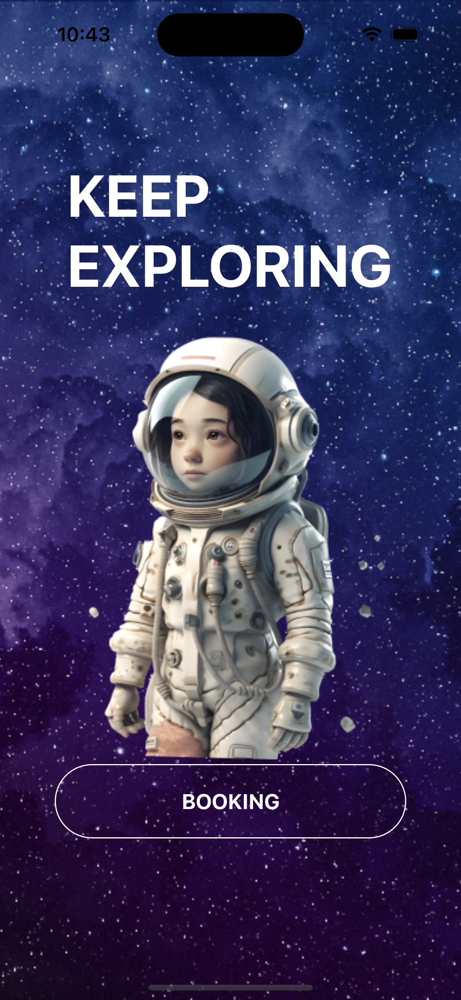
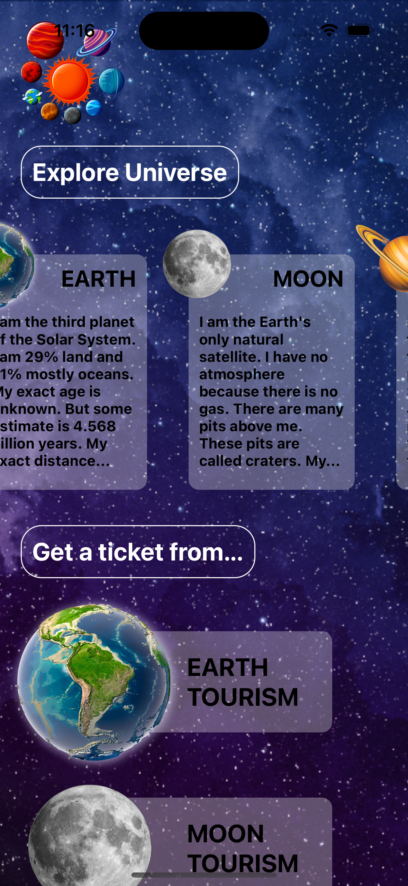
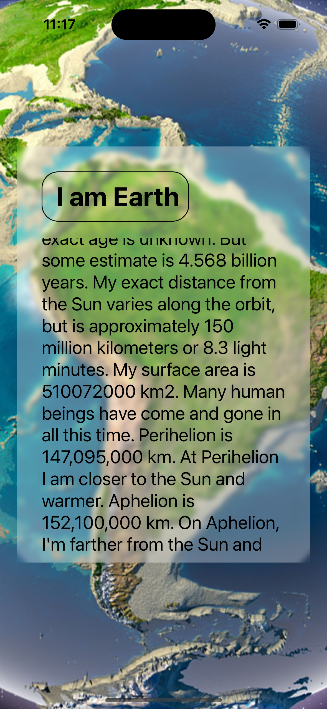
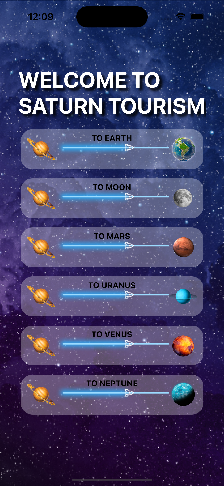
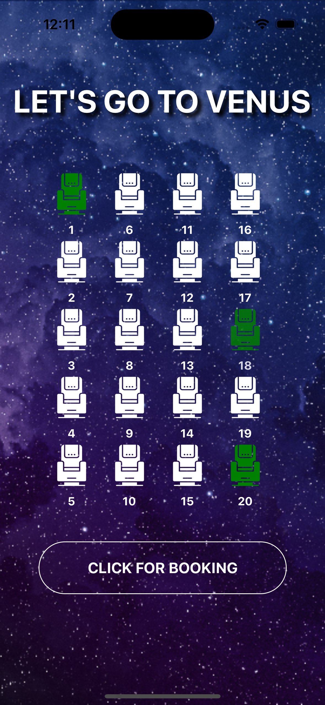
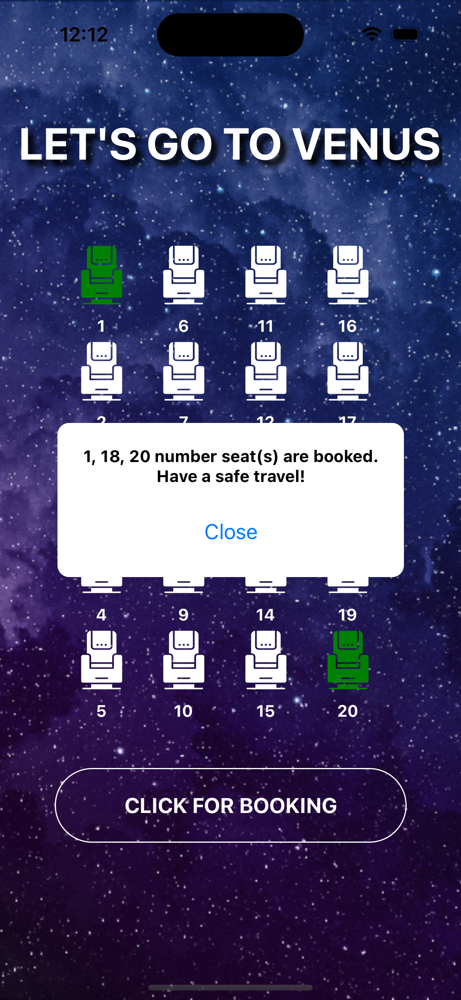

<h1>X-Ticket</h1>

 X-ticket is a mobile application which provide you to select a ticket to travel between planets. 

 I coded this application on React native and also used Expo as Emulator. 

<h2>Screens explanation</h2>

1-First Screen is simple, there is one button on it as a down below 

  
2-After you click the "Booking" button you are going to be in Home screen. There is two slider component here. One of them horizontal and one of them vertical.

3-"Explore Universe" part is the information and horizontal slider part that you can get information about the planets. For example there is a Earth information at down below

  
4- "Get a Ticket From..." part is vertical slider part and each planet has their own tourism there so you can click the planet where you are and you can take a ticket from. For Example if you are at Saturn, saturn tourism will shown as down below

  
  
5- Then you can go Wherever planet you want that in the tourism screen, if you are going to Venus, just click that and it is going to shown as... 

   

6-Finally you can selected the seats and click for booking, have safe travel!!!

 
